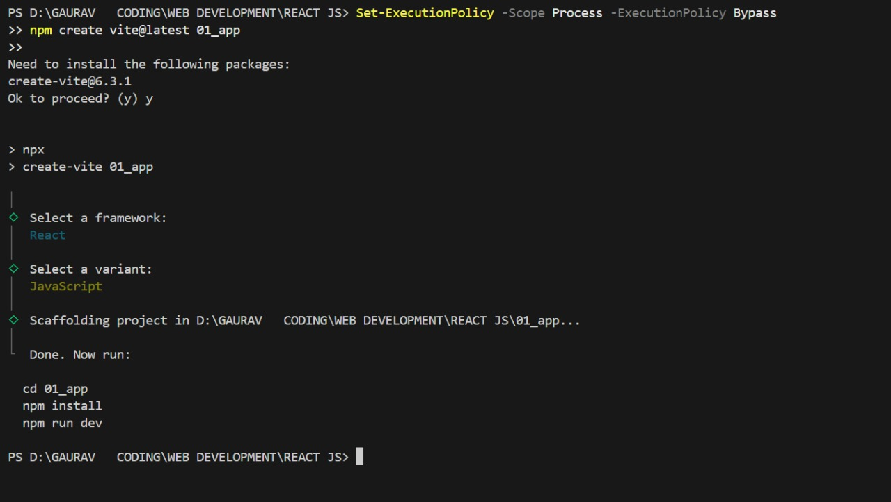
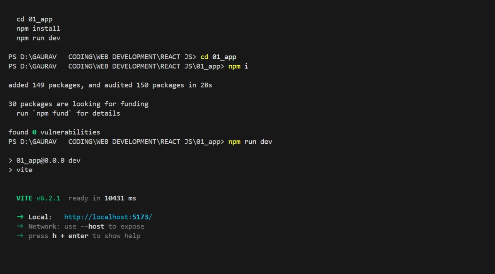

# Creating a React App using Vite

## Step 1: Set Execution Policy (If Required)
Open PowerShell and run the following command to temporarily bypass execution policy restrictions:

```powershell
Set-ExecutionPolicy -Scope Process -ExecutionPolicy Bypass
```

## Step 2: Create a React App with Vite
Navigate to your desired directory and execute:

```powershell
npm create vite@latest 01_app
```

You'll be prompted with:

```
Need to install the following packages:
create-vite@6.3.1
Ok to proceed? (y) y
```

Press `y` to continue.

## Step 3: Select Framework and Variant
You'll be guided through the setup:

1. **Select a framework:** `React`
2. **Select a variant:** `JavaScript`

Once selected, Vite will scaffold the project.

## Step 4: Navigate to the Project Folder
```powershell
cd 01_app
```

## Step 5: Install Dependencies
Run the following command to install the necessary dependencies:

```powershell
npm install
```

## Step 6: Start the Development Server
Run the command to launch the React app:

```powershell
npm run dev
```

Your React app is now set up and running on a local development server!

## Screenshot of the Process

<br>
