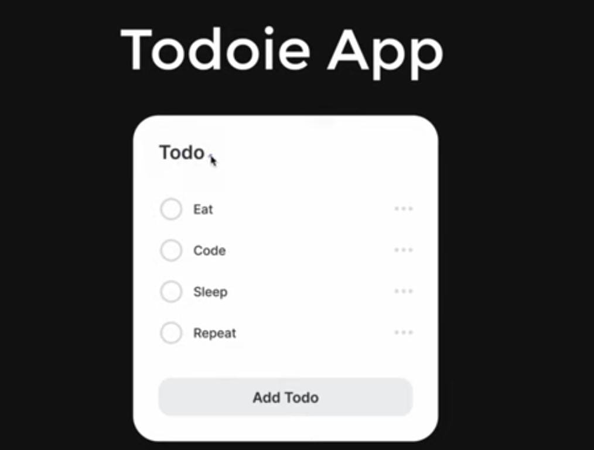
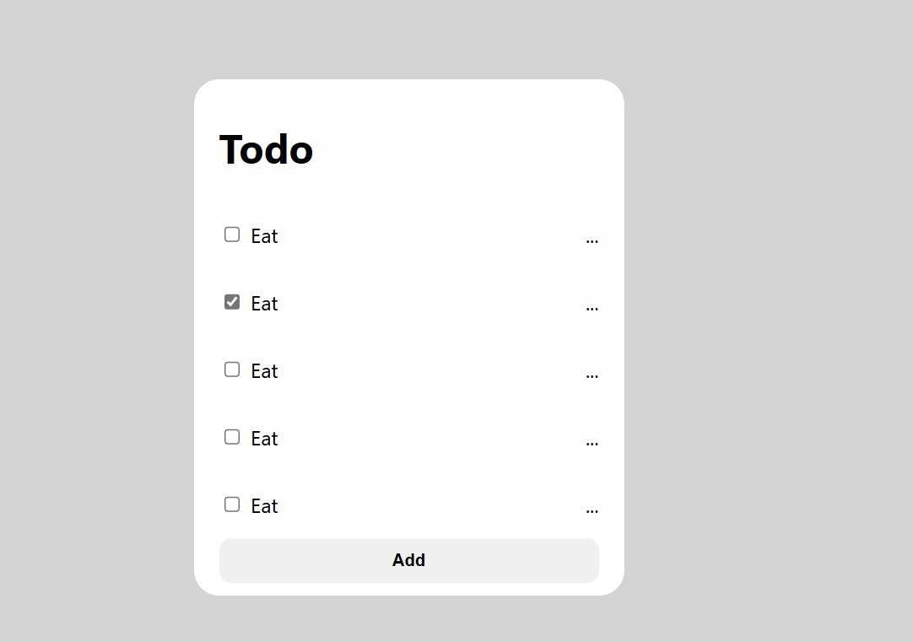

# To-Do App Design

## Overview
This project aims to build a simple To-Do App while learning more about React components.



## Initial Setup

### Modify `App.jsx`
Remove the default code and replace it with the following:

```jsx
import React from "react";

const App = () => {
  return <p>Todoie App</p>;
};

export default App;
```

## Creating Components

Create a `components` folder and add all components there. Update `App.jsx` accordingly.

### `Header.jsx`
Create `Header.jsx` inside the `components` folder.

### `TodoItem.jsx`

#### Initial Attempt (Error)
The following code caused an error because multiple elements were returned without a common parent:

```jsx
import React from "react";

const TodoItem = () => {
    return (
        <input type="checkbox" />
        <p>Eat</p>
        <p>...</p>
    );
};
```

#### Fixed Version
To resolve this, we wrapped the elements inside a `<li>` tag to ensure a single parent element:

```jsx
import React from "react";

const TodoItem = () => {
    return (
        <li>
            <input type="checkbox" />
            <p>Eat</p>
            <p>...</p>
        </li>
    );
};

export default TodoItem;
```

#### Final Code:-

```jsx
import React from "react";

const TodoItem = () => {
    return (
        <li className="todo-item">
            <span>
                <input type="checkbox" />
                <span className="todo-item-text">Eat</span>
            </span>
            <p>...</p>
        </li>
    )
}

export default TodoItem;
```


### `Button.jsx`
A `Button.jsx` component was created for handling button functionality.

```jsx
import React from "react";

const Button = () => {
    return <button className="todo-button">Add </button>
}

export default Button;
```

### Modify `App.jsx`

#### Final Code:-

```jsx
import React from "react";
import "./App.css";
import Header from "../components/Header";
import TodoItem from "../components/TodoItem";
import Button from "../components/Button";

const App = () =>{
  return (
    <div className="todo-container">
      <Header />
      <TodoItem />
      <TodoItem />
      <TodoItem />
      <TodoItem />
      <TodoItem />
      <Button />
    </div>
  );
}

export default App;
```

### FINAL OUTPUT

