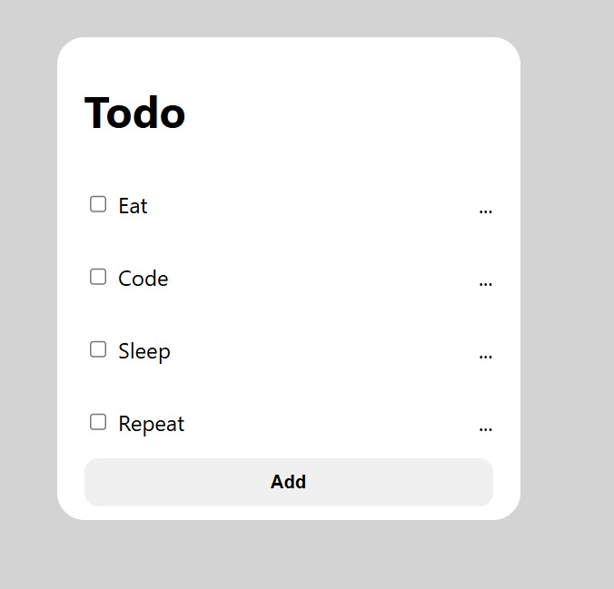
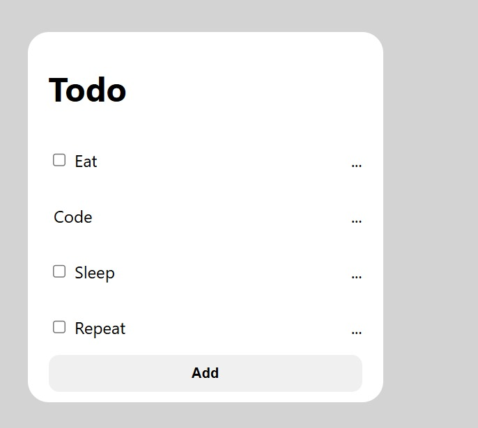
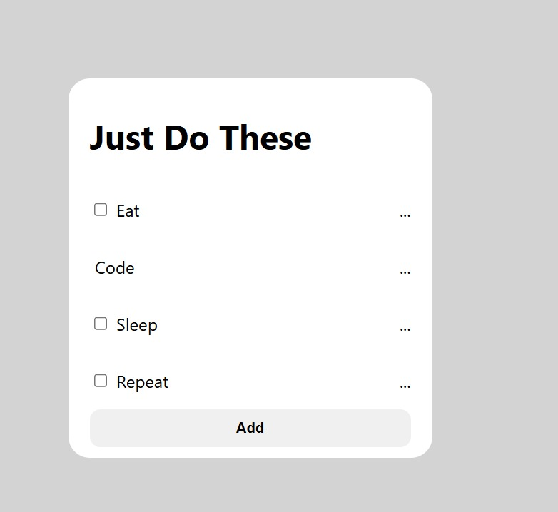

# Props in React

## Understanding Props
Props are like parameters of a function. They allow us to pass data to components, making them dynamic and reusable.

### Example:

#### Function Without Parameters:
```jsx
function MyHeader(){
    return <h1>Hello World</h1>
}
```

#### Function With Parameters (Props):
```jsx
function MyHeader(props){
    return <h1>{props.title}</h1>
}

<MyHeader title="This is my Heading" />
```

---

## Implementing Props in Todoie App

We created a new folder `05_Props_todo_item` and copied everything from `04_to_do_app`. Our goal is to make the Todo list dynamic so that tasks do not repeat blindly.

### Earlier Output:


### Goal Output:


### Updating `components/TodoItem.jsx`

#### Earlier Code:
```jsx
import React from "react";

const TodoItem = () => {
    return (
        <li className="todo-item">
            <span>
                <input type="checkbox" />
                <span className="todo-item-text">Eat</span>
            </span>
            <p>...</p>
        </li>
    )
}

export default TodoItem;
```

#### Updated Code Using Props:
```jsx
import React from "react";

const TodoItem = (props) => {
    return (
        <li className="todo-item">
            <span>
                <input type="checkbox" />
                <span className="todo-item-text">{props.text}</span>
            </span>
            <p>...</p>
        </li>
    )
}

export default TodoItem;
```

### Updating `App.jsx`

#### Earlier Code:
```jsx
<TodoItem />
<TodoItem />
<TodoItem />
<TodoItem />
```

#### Updated Code Using Props:
```jsx
<TodoItem text="Eat"/>
<TodoItem text="Code"/>
<TodoItem text="Sleep"/>
<TodoItem text="Repeat"/>
```

### New Output:


---

## Passing Multiple Props

We can also pass multiple attributes to a component.

### Conditionally Rendering in `components/TodoItem.jsx`

```jsx
{props.completed ? <></> : <input type="checkbox" />}
<span className="todo-item-text">{props.text}</span>
```

Here, `props.completed` is a boolean value (`true` or `false`). If the task is completed, the checkbox won't be shown; otherwise, it will be displayed.

### Updating `App.jsx`

```jsx
<TodoItem completed={true} text="Code"/>
```

### New Output:


---

## Updating `components/Header.jsx` for Dynamic Titles

#### Earlier Code:
```jsx
import React from "react";

const Header = () =>{
    return <h1 className="todo-header">Todo</h1>
}

export default Header;
```

#### Updated Code Using Props:
```jsx
import React from "react";

const Header = (props) =>{
    return <h1 className="todo-header">{props.title}</h1>
}

export default Header;
```

### Updating `App.jsx`

```jsx
<Header title="Just Do These"/>
```



```jsx
<Header title="Todoie App"/>
```