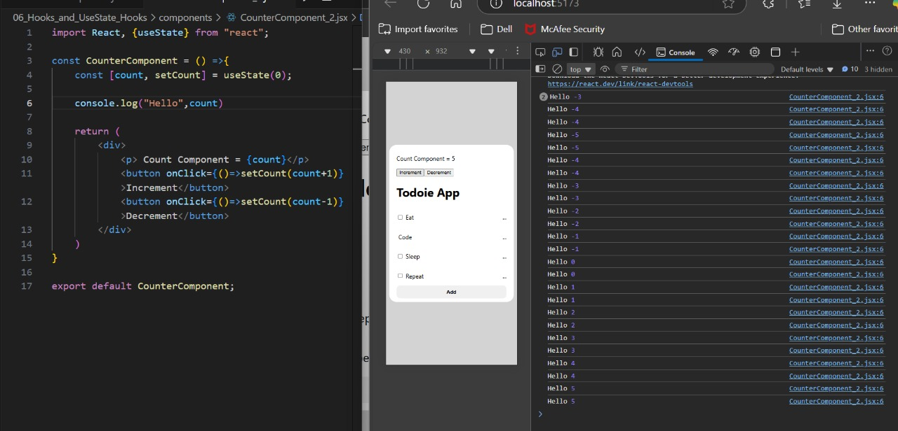
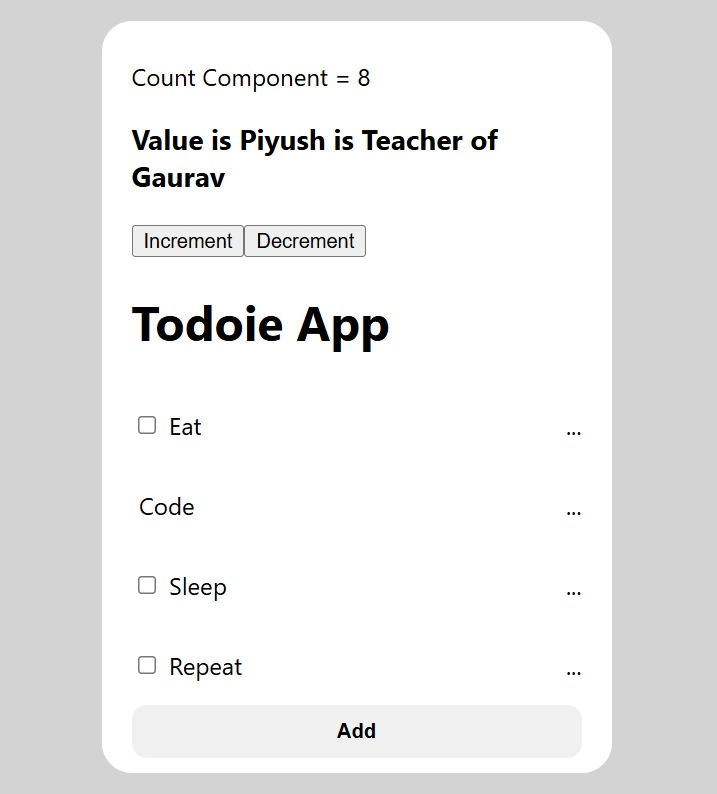
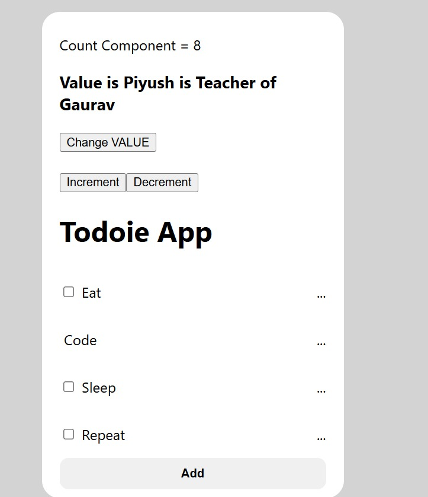
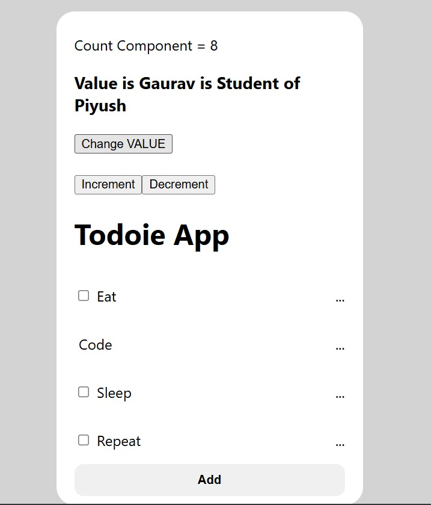
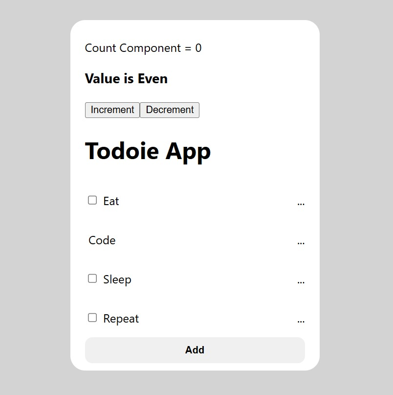
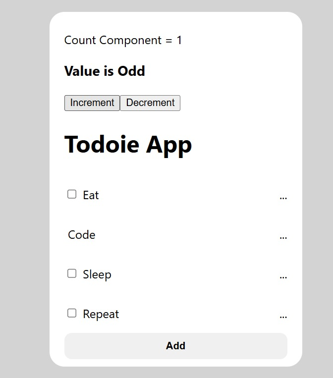
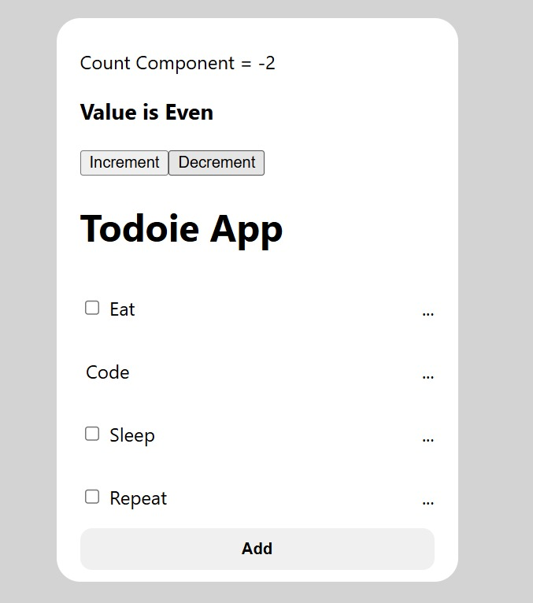

# React Hooks and useState Hook

## Life Cycle of a React Component

```
    ----------> Constructed ----------
    |                                |
    |                                V
 Un-Mounted                       Mounted
    ^                                |
    |                                |
    ---------- Constructed <---------
```

### Lifecycle Definitions:
- **Constructed**: Component is created.
- **Mounted**: Component is rendered on the screen.
- **Updated**: When the component is mounted, it can re-render multiple times (e.g., updating cart price when adding items).
- **Un-Mounted**: Component is removed from the screen.

### Importance of Understanding Lifecycle
Knowing the lifecycle is crucial for managing state, side effects, and optimizing performance.

---

## `useState` Hook

### What is State?
- A **state** is a variable that holds information which may change over the component's lifetime.
- When the state updates, the component re-renders.
- Every component has its own state.

### `useState` Hook Code Example:
```jsx
import React, { useState } from 'react';

function CounterComponent() {
    const [count, setCount] = useState(0);  // Initial value of count is 0

    return (
        <div>
            <p> Count is {count} </p>
            <button onClick={() => setCount(count + 1)}>Increment</button>
        </div>
    );
}
```
#### Functionality:
- Clicking the **Increment** button increases the count value.

---

## Setting Up Folder Structure

1. Create a new folder: **`06_Hooks_and_UseState_Hooks`**
2. Copy all contents from **`05_Props_todo_item`** into it.
3. Inside the `components` folder, create a new file **`CounterComponent.jsx`**

### Initial `CounterComponent.jsx` Code:
```jsx
import React, { useState } from "react";

const CounterComponent = () => {
    const val = useState(0);
    console.log(val);   // Check what useState returns

    return (
        <div>
            <p> Count Component</p>
        </div>
    );
}

export default CounterComponent;
```

### Update `App.jsx` to Include the Component:
```jsx
import CounterComponent from "../components/CounterComponent";

function App() {
    return (
        <div>
            <CounterComponent />
        </div>
    );
}

export default App;
```

---

## Updating `CounterComponent.jsx`

```jsx
import React, { useState } from "react";

const CounterComponent = () => {
    const [count, setCount] = useState(15);

    return (
        <div>
            <p> Count Component = {count}</p>
            <button onClick={() => setCount(45)}>Increment</button>
        </div>
    );
}

export default CounterComponent;
```

#### Expected Output:
- Initially: `15`
- Clicking **Increment** sets count to `45`.

---

## Adding a Decrement Button

```jsx
import React, { useState } from "react";

const CounterComponent = () => {
    const [count, setCount] = useState(15);

    return (
        <div>
            <p> Count Component = {count}</p>
            <button onClick={() => setCount(45)}>Increment</button>
            <button onClick={() => setCount(15)}>Decrement</button>
        </div>
    );
}

export default CounterComponent;
```

#### Expected Output:
- Initially: `15`
- **Increment Button** → `45`
- **Decrement Button** → `15`

---

## Understanding Hooks
- All React Hooks start with `use`, e.g., `useState`, `useEffect`, `useMemo`, etc.
- **Good Practice**: Prefix state update functions with `set` (e.g., `[count, setCount]`), making it clear that `setCount` updates `count`.

---

## Incrementing and Decrementing Properly

### Create `CounterComponent_2.jsx` in `components` Folder

```jsx
import React, { useState } from "react";

const CounterComponent = () => {
    const [count, setCount] = useState(0);

    return (
        <div>
            <p> Count Component = {count}</p>
            <button onClick={() => setCount(count + 1)}>Increment</button>
            <button onClick={() => setCount(count - 1)}>Decrement</button>
        </div>
    );
}

export default CounterComponent;
```

### Update `App.jsx`

```jsx
import CounterComponent from "../components/CounterComponent_2";

function App() {
    return (
        <div>
            <CounterComponent />
        </div>
    );
}

export default App;
```

#### Expected Output:
- Initially: `0`
- Clicking **Increment** 5 times → `5`
- Clicking **Decrement** 8 times → `-3`

---

## Summary
- **Hooks are essential in React.**
- **`useState` helps manage component state.**
- **Lifecycle understanding helps in optimizing and debugging applications.**
- **Best practices include using `set` as a prefix for state-updating functions.**

### Now Added console.log("Hello",count) at CounterComponent_2
To Prove Page re-renders each time. Whenever the value of the state changes.

Here is The Screenshot of the Proof:


### One Component Can Have Multiple State
Created `CounterComponent_3.jsx` and pasted the code of `CounterComponent_2` in it.

**Updated Code:**
```javascript
import React, {useState} from "react";

const CounterComponent = () => {
    const [count, setCount] = useState(0);
    const [value, setValue] = useState('Piyush is Teacher of Gaurav');

    return (
        <div>
            <p> Count Component = {count}</p>
            <h3>Value is {value} </h3>
            <button onClick={() => setCount(count+1)}>Increment</button>
            <button onClick={() => setCount(count-1)}>Decrement</button>
        </div>
    );
}

export default CounterComponent;
```

**Updated `App.jsx`:**
```javascript
import CounterComponent from "../components/CounterComponent_3"
```

**Output:**


### Adding Button to Change Value on Click

**Updated Code:**
```javascript
import React, {useState} from "react";

const CounterComponent = () => {
    const [count, setCount] = useState(0);
    const [value, setValue] = useState('Piyush is Teacher of Gaurav');

    return (
        <div>
            <p> Count Component = {count}</p>
            <h3>Value is {value} </h3>
            <button onClick={() => setValue("Gaurav is Student of Piyush")}>Change VALUE</button>
            <br />
            <br />
            <button onClick={() => setCount(count+1)}>Increment</button>
            <button onClick={() => setCount(count-1)}>Decrement</button>
        </div>
    );
}

export default CounterComponent;
```

**Initial Output:**


**OnClick Changed Output:**


---

## Assignment: CounterComponent_Assignment

Set value as "Odd" if Counter Value is Odd and "Even" if Counter Value is Even.

**Code:**
```javascript
import React, { useState } from "react";

const CounterComponent = () => {
    const [count, setCount] = useState(0);
    return (
        <div>
            <p> Count Component = {count}</p>
            <h3>Value is {count % 2 === 0 ? "Even" : "Odd"} </h3>
            <button onClick={() => setCount(count + 1)}>Increment</button>
            <button onClick={() => setCount(count - 1)}>Decrement</button>
        </div>
    );
};

export default CounterComponent;
```

**OR**

```javascript
import React, { useState } from "react";

const CounterComponent = () => {
    const [count, setCount] = useState(0);
    const [value, setValue] = useState("Even");

    const handleIncrement = () => {
        const newCount = count + 1;
        setCount(newCount);
        setValue(newCount % 2 === 0 ? "Even" : "Odd");
    };

    const handleDecrement = () => {
        const newCount = count - 1;
        setCount(newCount);
        setValue(newCount % 2 === 0 ? "Even" : "Odd");
    };

    return (
        <div>
            <p> Count Component = {count}</p>
            <h3>Value is {value} </h3>
            <button onClick={handleIncrement}>Increment</button>
            <button onClick={handleDecrement}>Decrement</button>
        </div>
    );
};

export default CounterComponent;
```

**Updated `App.jsx`:**
```javascript
import CounterComponent from "../components/CounterComponent_Assignment"
```

**Initial Output:**


**OnClick Changed Count to 1:**


**OnClick Changed Count to -2:**


### Conclusion
This demonstrates the power of React where whenever the state changes, the value updates automatically, triggering a re-render. In JavaScript, this had to be handled manually.

For more about Hooks, visit: [ReactJS Hooks Documentation](https://legacy.reactjs.org/docs/cdn-links.html) (Check the dropdown on the RHS).