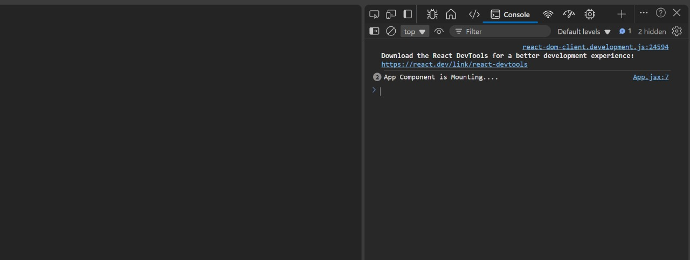
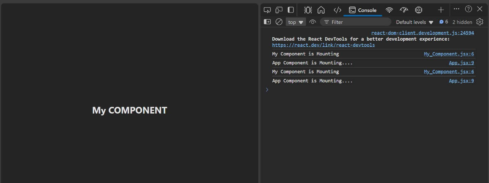
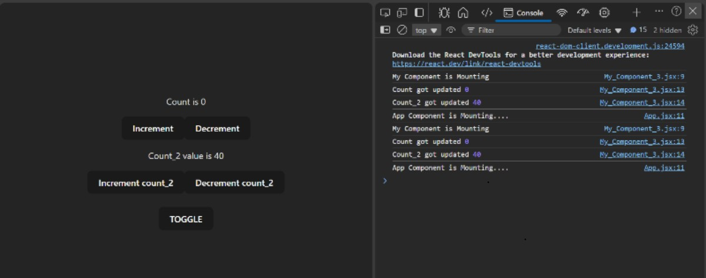
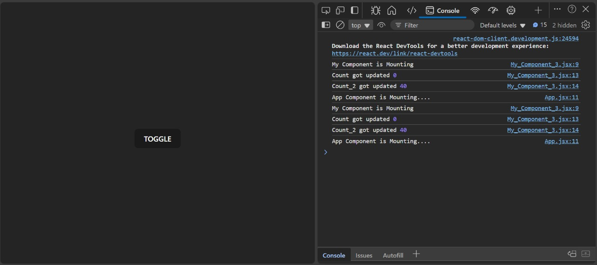
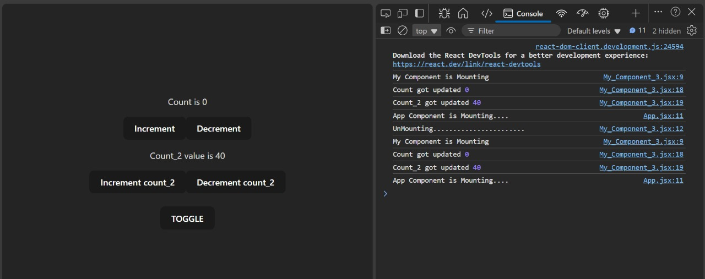
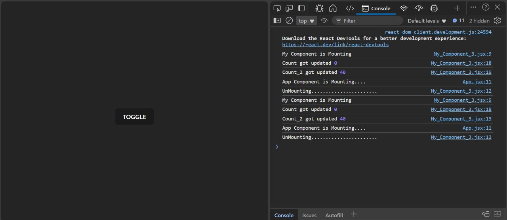
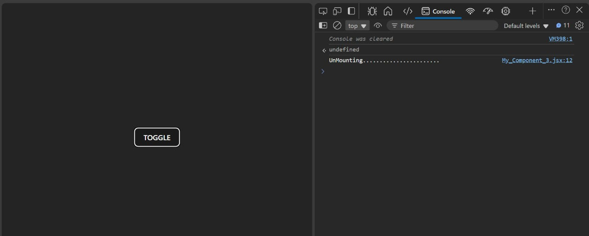
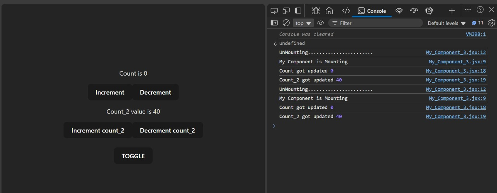
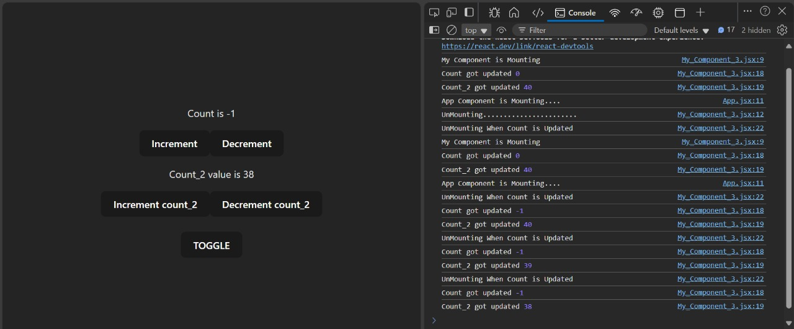

# React Hooks and useEffect Hook

## Life Cycle of a React Component

```
    ----------> Constructed ----------
    |                                |
    |                                V
 Un-Mounted                       Mounted
    ^                                |
    |                                |
    ---------- Constructed <---------
                    OR
                  Update
```

## Understanding useEffect Hook

The `useEffect` Hook allows us to run specific code at different stages of a component's lifecycle. For instance, when a page containing a blog card component is mounted, we can use `useEffect` to fetch and display blog content.

### useEffect Hook Syntax
```jsx
import React, { useEffect } from 'react';

const MyComponent = () => {
    useEffect(() => {
        console.log('Hello');
    }, []);

    return (
        <div>
            <p>Hey There</p>
        </div>
    );
};
```

### Explanation
1. **First Argument**: The function `{ console.log('Hello') }` runs when the component mounts.
2. **Second Argument (Dependency Array)**: `[]` ensures the effect runs only once when the component mounts.

## Project Setup
### Creating Folder Structure
1. **Folder:** `07_Hooks_and_UseEffect_Hook`
2. **Remove default code from `App.jsx`** and replace it with the following:

```jsx
import React, { useEffect } from 'react';
import './App.css';

function App() {
    useEffect(() => {
        console.log('App Component is Mounting...');
    }, []);

    return <div className='App'></div>;
}

export default App;
```

### Expected Output:
```
App Component is Mounting...
```


## Creating a Component
### Steps:
1. **Create a `components` folder.**
2. **Inside `components`, create `My_Component.jsx` with the following code:**

```jsx
import React, { useEffect } from 'react';

const MyComponent = () => {
    useEffect(() => {
        console.log('My Component is Mounting');
    }, []);

    return <h2>My COMPONENT</h2>;
};

export default MyComponent;
```

### Updating `App.jsx`
```jsx
import React, { useEffect } from 'react';
import './App.css';
import MyComponent from '../components/My_Component';

function App() {
    useEffect(() => {
        console.log('App Component is Mounting...');
    }, []);

    return (
        <div className='App'>
            <MyComponent />
        </div>
    );
}

export default App;
```

### Expected Output:
```
App Component is Mounting...
My Component is Mounting...
```


### Explanation
1. **App Component Mounts → `console.log("App Component is Mounting...")` is executed.**
2. **MyComponent Mounts → `console.log("My Component is Mounting")` is executed.**
3. **Re-rendering may occur, leading to repeated logs if dependencies change.**

## Conclusion
The `useEffect` hook is crucial for handling side effects in functional components, such as fetching data, updating the DOM, or managing subscriptions. Understanding its lifecycle behavior helps optimize React applications effectively.

---

# Understanding `useEffect` and Dependency Array in React

## Running Code When State is Updated

### Initial Component (`My_Component_2`)
We first create `MyComponent` in `components/My_Component_2`, where we use `useState` to create a counter and `useEffect` to log a message when the component mounts.

```jsx
import React, { useEffect, useState } from "react";

const MyComponent = () => {
    const [count, setCount] = useState(0);

    useEffect(() => {
        console.log('My Component is Mounting');
    }, []); // Runs only on mount

    return (
        <div>
            <p>Count is {count}</p>
            <button onClick={() => setCount(count + 1)}>Increment</button>
            <button onClick={() => setCount(count - 1)}>Decrement</button>
        </div>
    );
};

export default MyComponent;
```

### Updating `useEffect` to Track State Changes
Here, the `useEffect` only runs when the component mounts. To ensure it runs when `count` updates, we add `count` to the dependency array.

```jsx
useEffect(() => {
    console.log("Count got updated", count);
}, [count]); // Runs when 'count' updates
```

#### Updated Component:
```jsx
import React, { useEffect, useState } from "react";

const MyComponent = () => {
    const [count, setCount] = useState(0);

    useEffect(() => {
        console.log('My Component is Mounting');
    }, []);

    useEffect(() => {
        console.log("Count got updated", count);
    }, [count]);

    return (
        <div>
            <p>Count is {count}</p>
            <button onClick={() => setCount(count + 1)}>Increment</button>
            <button onClick={() => setCount(count - 1)}>Decrement</button>
        </div>
    );
};

export default MyComponent;
```

### Demonstrating Dependency Array
Now, we introduce another state variable, `count_2`, and observe how `useEffect` behaves when dependencies change.

```jsx
import React, { useEffect, useState } from "react";

const MyComponent = () => {
    const [count, setCount] = useState(0);
    const [count_2, setCount_2] = useState(40);

    useEffect(() => {
        console.log('My Component is Mounting');
    }, []);

    useEffect(() => {
        console.log("Count got updated", count);
    }, [count]);

    return (
        <div>
            <p>Count is {count}</p>
            <button onClick={() => setCount(count + 1)}>Increment</button>
            <button onClick={() => setCount(count - 1)}>Decrement</button>
            
            <p>Count_2 value is {count_2}</p>
            <button onClick={() => setCount_2(count_2 + 1)}>Increment count_2</button>
            <button onClick={() => setCount_2(count_2 - 1)}>Decrement count_2</button>
        </div>
    );
};

export default MyComponent;
```

### Effect of Dependency Array
- Initially, only `count` is in the dependency array, so updating `count_2` doesn't trigger `useEffect`.
- Adding `count_2` ensures `useEffect` runs when either `count` or `count_2` updates.

#### Updated `useEffect`:
```jsx
useEffect(() => {
    console.log("Count got updated", count);
    console.log("Count_2 got updated", count_2);
}, [count, count_2]);
```

### Summary
1. **Empty Dependency Array (`[]`)**: Runs only when the component mounts.
2. **Variable in Dependency Array (`[count]`)**: Runs when the specified state variable updates.
3. **Multiple Variables (`[count, count_2]`)**: Runs when any of the listed variables update.

Using `useEffect` effectively allows better control over side effects, ensuring components update dynamically based on state changes.

---
# Using `useEffect` When a Component is Unmounted

## Updating `App.jsx`

### Before Adding `useState`

```jsx
import React, { useEffect } from 'react';
import './App.css';

import MyComponent from '../components/My_Component_2';

function App() {
  useEffect(() => {
    console.log('App Component is Mounting....');
  }, []);

  return (
    <div className='App'>
      <MyComponent />
    </div>
  );
}

export default App;
```

### After Adding `useState`

```jsx
import React, { useEffect, useState } from 'react';
import './App.css';

import MyComponent from '../components/My_Component_3';

function App() {
  const [isVisible, setVisible] = useState(true);

  useEffect(() => {
    console.log('App Component is Mounting....');
  }, []);

  return (
    <div className='App'>
      {isVisible ? <MyComponent /> : <></>}
      <br />
      <button onClick={() => setVisible(!isVisible)}>TOGGLE</button>
    </div>
  );
}

export default App;
```

### Behavior Explanation
- Initially, the `MyComponent` is displayed.
- Clicking the **TOGGLE** button hides `MyComponent`.
- Clicking it again displays `MyComponent` back.

### Screenshots
- **Initially Displayed:**
  
- **After Clicking Toggle (Hidden):**
  

---

## Cleaning Up on Component Unmount

To perform cleanup when `MyComponent` is unmounted, we add a cleanup function inside `useEffect`.

### Updating `My_Component_3.jsx`

```jsx
import React, { useEffect, useState } from 'react';

const MyComponent = () => {
  const [count, setCount] = useState(0);
  const [count_2, setCount_2] = useState(40);

  useEffect(() => {
    console.log('My Component is Mounting');

    return function () {
      console.log('UnMounting.......................');
    };
  }, []);

  useEffect(() => {
    console.log('Count got updated', count);
    console.log('Count_2 got updated', count_2);
  }, [count, count_2]);

  return (
    <div>
      <p>Count is {count}</p>
      <button onClick={() => setCount(count + 1)}>Increment</button>
      <button onClick={() => setCount(count - 1)}>Decrement</button>

      <p>Count_2 value is {count_2}</p>
      <button onClick={() => setCount_2(count_2 + 1)}>Increment count_2</button>
      <button onClick={() => setCount_2(count_2 - 1)}>Decrement count_2</button>
    </div>
  );
};

export default MyComponent;
```

### Explanation
- **Mounting Effect:** Logs "My Component is Mounting".
- **Unmounting Effect:** Logs "UnMounting......................." when `MyComponent` is removed.
- **State Update Effect:** Logs when `count` or `count_2` is updated.

### Screenshots
- **Initially Mounted:**
  
- **After Toggling Off (Unmounted):**
  
- **Clear Console Before Next Toggle:**
  
- **After Toggling On (Remounted):**
  

---

## Summary

1. **When Dependency Array is Empty (`[]`)** → Runs only when the component is **mounted**.
2. **When Dependencies are Added (`[state]`)** → Runs **when the state is updated**.
3. **When Returning a Function in `useEffect`** → Runs **when the component is unmounted** (for cleanup).

---

## Updating My_Component_3

```jsx
import React, { useEffect, useState } from "react";

const MyComponent = () => {
    const [count, setCount] = useState(0);    
    const [count_2, setCount_2] = useState(40);    

    // Effect runs on component mount
    useEffect(() => {
        console.log('My Component is Mounting');

        return () => {
            console.log('UnMounting...');
        };
    }, []);

    // Effect runs when count or count_2 updates
    useEffect(() => {
        console.log("Count got updated", count);
        console.log("Count_2 got updated", count_2);

        return () => {
            console.log('UnMounting When Count is Updated');
        };
    }, [count, count_2]);

    return (
        <div>
            <p>Count is {count}</p>
            <button onClick={() => setCount(count + 1)}>Increment</button>
            <button onClick={() => setCount(count - 1)}>Decrement</button>
            
            <p>Count_2 value is {count_2}</p>
            <button onClick={() => setCount_2(count_2 + 1)}>Increment count_2</button>
            <button onClick={() => setCount_2(count_2 - 1)}>Decrement count_2</button>
        </div>
    );
};

export default MyComponent;
```

## Explanation
- **First `useEffect` (Mounting Phase):** Runs only when the component mounts (`[]` dependency array).
- **Second `useEffect` (Updating Phase):** Runs whenever `count` or `count_2` changes. It logs updates and provides a cleanup function.
- **Unmounting Behavior:**
  - The first effect logs when the component is unmounted.
  - The second effect logs unmounting when `count` or `count_2` updates.

### Re-Rendering Behavior
Whenever `count` or `count_2` updates, React re-renders the component:
1. The previous effect's cleanup function runs (unmounting behavior).
2. The updated effect runs again (new values logged).



For more details about React Hooks, visit: [ReactJS Hooks Documentation](https://legacy.reactjs.org/docs/cdn-links.html) (Check the dropdown on the RHS).
