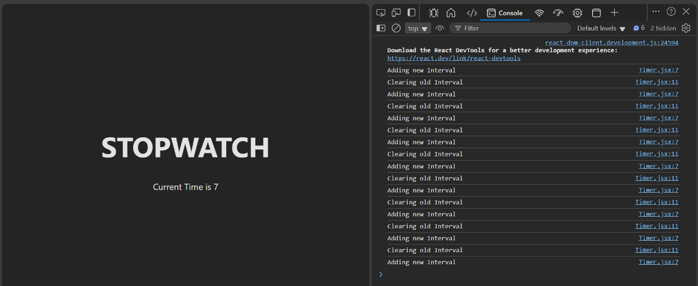

# Understanding Hooks with Stopwatch Timer

## Problem Statement
When implementing a stopwatch timer using React Hooks, an issue arises where the interval keeps stacking up, causing glitches and performance issues. This occurs because a new interval is created on every render without clearing the previous one.

## Initial Implementation
```jsx
import React, { useEffect, useState } from 'react';

const Timer = () => {
    const [time, setTime] = useState(0);

    useEffect(() => {
        const timer = setInterval(() => setTime(time + 1), 1000); // Increments time every second
    }, [time]);

    return (
        <div>
            <h1>STOPWATCH</h1>
            <p>Current Time is {time}</p>
        </div>
    );
}

export default Timer;
```
### Issue:
- The `useEffect` dependency array contains `time`, meaning a new interval is created on every state update.
- This results in multiple active intervals running concurrently, leading to unexpected behavior.

## Fix: Clearing Previous Intervals
To prevent multiple intervals from stacking, we need to clear the previous interval before setting a new one:

```jsx
import React, { useEffect, useState } from 'react';

const Timer = () => {
    const [time, setTime] = useState(0);

    useEffect(() => {
        const timer = setInterval(() => setTime(prevTime => prevTime + 1), 1000); // Using functional update
    
        return () => clearInterval(timer); // Cleanup function to clear previous interval
    }, []); // Empty dependency array to run the effect only once

    return (
        <div>
            <h1>STOPWATCH</h1>
            <p>Current Time is {time}</p>
        </div>
    );
}

export default Timer;
```

### Key Improvements:
1. **Using Functional Update**: Instead of directly modifying `time`, we use `prevTime => prevTime + 1` to ensure accurate updates.
2. **Proper Cleanup**: The cleanup function `clearInterval(timer)` prevents multiple intervals from running simultaneously.
3. **Empty Dependency Array (`[]`)**: Ensures that the effect runs only once when the component mounts, instead of every state update.

Now, the stopwatch functions smoothly without accumulating multiple intervals, ensuring optimal performance.

---
---

# Stopwatch Timer using React

## Code Implementation

```jsx
import React, { useEffect, useState } from 'react';

const Timer = () => {
    const [time, setTime] = useState(0);

    useEffect(() => {
        console.log('Adding new Interval');
        const timer = setInterval(() => setTime((prevTime) => prevTime + 1), 1000); // Increment time every second

        return () => {
            console.log('Clearing old Interval');
            clearInterval(timer);
        };
    }, []);

    return (
        <div>
            <h1>STOPWATCH</h1>
            <p>Current Time: {time}</p>
        </div>
    );
};

export default Timer;
```

## Output Explanation

- The **`useEffect` hook** sets an interval that increments the `time` state by `1` every second.
- When the component re-renders, the old interval is cleared to prevent multiple intervals from stacking up.
- This ensures a **smooth and lag-free experience**.

## Expected Console Output:

```
Adding new Interval
Clearing old Interval
Adding new Interval
Clearing old Interval
...
```

## Screenshot of the Output



---
This optimized version ensures that the interval is correctly managed without unnecessary re-renders.
<br>
Here we are Clearing old Interval when new is created to remove lag and keep stack empty

For more details about React Hooks, visit: [ReactJS Hooks Documentation](https://legacy.reactjs.org/docs/cdn-links.html) (Check the dropdown on the RHS).