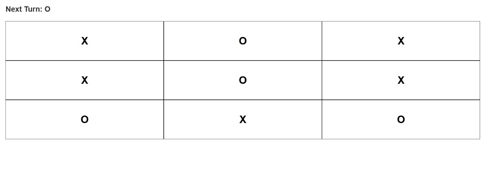
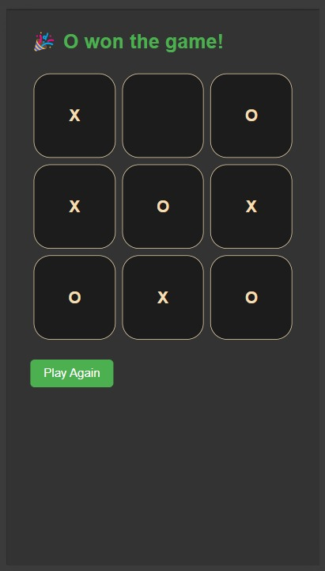
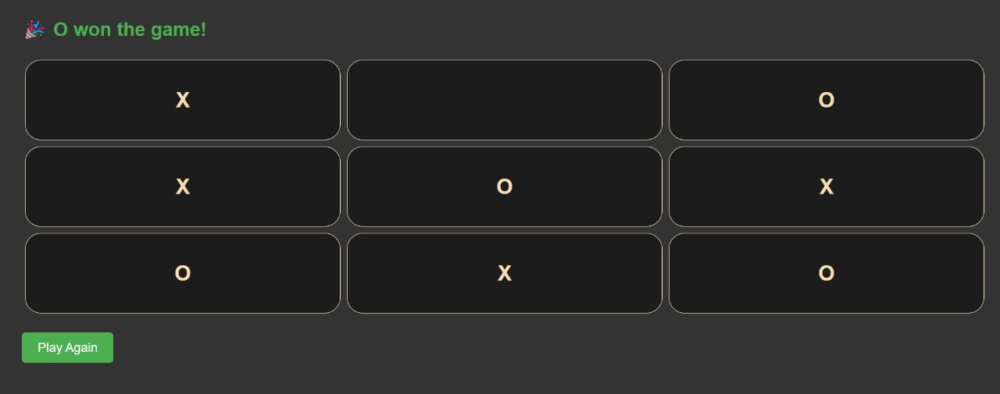

# 🕹️ Tic Tac Toe in React

## Components Breakdown

For this Tic Tac Toe game, we need **two components**:

### 1️⃣ `Square`
### 2️⃣ `Board`

---

## 📁 `component/Square.jsx`

```jsx
import React from "react";

const Square = (props) => {
    return (
        <div 
        onClick={props.onClick}
        style={{
            border: '1px solid ',
            height: '100px',
            width: '100%',
            display: 'flex',
            justifyContent: 'center',
            alignItems: 'center'
        }}
        className="square">
            <h5>{props.value}</h5>
        </div>
    )
}

export default Square;
```

---

## 📁 `App.jsx`

```jsx
import React from 'react';
import './App.css';
import Board from '../components/Board';

function App() {
  return (
    <div className='App'>
      <Board />
    </div>
  );
}

export default App;
```

---

## 🧠 React State Tip

When managing arrays/objects in `useState`, **never directly mutate the state**, always make a copy first.

```jsx
const [state, setState] = useState(Array(9).fill(null));

// ❌ BAD (Direct Mutation)
state[index] = "X";

// ✅ GOOD (Copy and Update)
const copyState = [...state];
copyState[index] = "X";
setState(copyState);
```

### Why?

React does shallow comparisons (`===`) to detect changes. By mutating the array directly, React might **skip re-rendering**.

---

## 🔲 `Board.jsx` (Base Implementation)

```jsx
import React, {useState} from "react";
import Square from "./Square";

const Board = () => {
    const [state, setState] = useState(Array(9).fill(null));
    const [isXTurn, setIsXTurn] = useState(true);

    const handleClick = (index) => {
        if (state[index]) return;

        const copyState = [...state];
        copyState[index] = isXTurn ? "X" : "O";
        setState(copyState);
        setIsXTurn(!isXTurn);
    };

    return (
        <div className="board-container">
            <div className="board-row">
                <Square onClick={() => handleClick(0)} value={state[0]} />
                <Square onClick={() => handleClick(1)} value={state[1]} />
                <Square onClick={() => handleClick(2)} value={state[2]} />
            </div>
            <div className="board-row">
                <Square onClick={() => handleClick(3)} value={state[3]} />
                <Square onClick={() => handleClick(4)} value={state[4]} />
                <Square onClick={() => handleClick(5)} value={state[5]} />
            </div>
            <div className="board-row">
                <Square onClick={() => handleClick(6)} value={state[6]} />
                <Square onClick={() => handleClick(7)} value={state[7]} />
                <Square onClick={() => handleClick(8)} value={state[8]} />
            </div>
        </div>
    )
}

export default Board;
```

---

# There is No Logic For Draw in Game :-



---

## 🏆 Adding `checkWinner` & Draw Logic

### Updated `Board.jsx`

```jsx
import React, {useState} from "react";
import Square from "./Square";

const Board = () => {
    const [state, setState] = useState(Array(9).fill(null));
    const [isXTurn, setIsXTurn] = useState(true);

    const checkWinner = () =>{
        const winnerLogic = [
            [0, 1, 2],
            [3, 4, 5],
            [6, 7, 8],
            [0, 3, 6],
            [1, 4, 7],
            [2, 5, 8],
            [0, 4, 8],
            [2, 4, 6],
        ];

        for (let logic of winnerLogic) {
            const [a, b, c] = logic;
            if(state[a] && state[a] === state[b] && state[a] === state[c]){
                return state[a];
            }
        }
        return false;
    };

    const isWinner = checkWinner();
    const isDraw = !isWinner && state.every((square) => square !== null);

    const handleClick = (index) => {
        if (state[index] || isWinner) return;

        const copyState = [...state];
        copyState[index] = isXTurn ? "X" : "O";
        setState(copyState);
        setIsXTurn(!isXTurn);
    };

    const resetGame = () => {
        setState(Array(9).fill(null));
        setIsXTurn(true);
    };

    return (
        <div className="board-container">
            {isWinner ? (
                <div className="result">
                    <h2>🎉 {isWinner} won the game!</h2>
                    <button className="restart-btn" onClick={resetGame}>
                        Play Again
                    </button>
                </div>
            ) : isDraw ? (
                <div className="result">
                    <h2>🤝 It's a Draw!</h2>
                    <button className="restart-btn" onClick={resetGame}>
                        Restart Game
                    </button>
                </div>
            ) : (
                <>
                  <h3>Next Turn: {isXTurn ? "X" : "O"}</h3>
                  <div className="board-row">
                    <Square onClick={() => handleClick(0)} value={state[0]} />
                    <Square onClick={() => handleClick(1)} value={state[1]} />
                    <Square onClick={() => handleClick(2)} value={state[2]} />
                  </div>
                  <div className="board-row">
                    <Square onClick={() => handleClick(3)} value={state[3]} />
                    <Square onClick={() => handleClick(4)} value={state[4]} />
                    <Square onClick={() => handleClick(5)} value={state[5]} />
                  </div>
                  <div className="board-row">
                    <Square onClick={() => handleClick(6)} value={state[6]} />
                    <Square onClick={() => handleClick(7)} value={state[7]} />
                    <Square onClick={() => handleClick(8)} value={state[8]} />
                  </div>
                </>
            )}
        </div>
    );
};

export default Board;
```

---

## 🎯 Features so far:
- Clickable squares
- X and O turns
- Winner detection
- Draw detection
- Reset button

---

# Now,Display Play Again and Restart game Button below the tic tac toe game

## components/Board.jsx

```jsx
import React, { useState } from "react";
import Square from "./Square";

const Board = () => {
    const [state, setState] = useState(Array(9).fill(null));
    const [isXTurn, setIsXTurn] = useState(true);

    const checkWinner = () => {
        const winnerLogic = [
            [0, 1, 2],
            [3, 4, 5],
            [6, 7, 8],
            [0, 3, 6],
            [1, 4, 7],
            [2, 5, 8],
            [0, 4, 8],
            [2, 4, 6],
        ];

        for (let logic of winnerLogic) {
            const [a, b, c] = logic;

            if (state[a] && state[a] === state[b] && state[a] === state[c]) {
                return state[a];
            }
        }
        return false;
    };

    const isWinner = checkWinner();
    const isDraw = !isWinner && state.every((square) => square !== null);

    const handleClick = (index) => {
        if (state[index] || isWinner) return; // Prevent clicking on filled square or after win

        const copyState = [...state];
        copyState[index] = isXTurn ? "X" : "O";
        setState(copyState);
        setIsXTurn(!isXTurn);
    };

    const resetGame = () => {
        setState(Array(9).fill(null));
        setIsXTurn(true);
    };

    return (
        <div className="board-container">
            {isWinner ? (
                <div className="result">
                    <h2>🎉 {isWinner} won the game!</h2>
                </div>
            ) : isDraw ? (
                <div className="result">
                    <h2>🤝 It's a Draw!</h2>
                </div>
            ) : (
                <h3>Next Turn: {isXTurn ? "X" : "O"}</h3>
            )}

            <div className="board-row">
                <Square onClick={() => handleClick(0)} value={state[0]} />
                <Square onClick={() => handleClick(1)} value={state[1]} />
                <Square onClick={() => handleClick(2)} value={state[2]} />
            </div>
            <div className="board-row">
                <Square onClick={() => handleClick(3)} value={state[3]} />
                <Square onClick={() => handleClick(4)} value={state[4]} />
                <Square onClick={() => handleClick(5)} value={state[5]} />
            </div>
            <div className="board-row">
                <Square onClick={() => handleClick(6)} value={state[6]} />
                <Square onClick={() => handleClick(7)} value={state[7]} />
                <Square onClick={() => handleClick(8)} value={state[8]} />
            </div>

            <button 
                className="restart-btn" 
                onClick={resetGame} 
                style={{ marginTop: '20px' }}
            >
                {isWinner || isDraw ? "Play Again" : "Restart Game"}
            </button>
        </div>
    );
};

export default Board;
```

---

## components/Square.jsx

```jsx
import React from "react";

const Square = (props) => {
    return (
        <div 
            onClick={props.onClick}
            style={{
                border: '1px solid',
                height: '100px',
                width: '100%',
                display: 'flex',
                justifyContent: 'center',
                alignItems: 'center'
            }}
            className="square"
        >
            <h5>{props.value}</h5>
        </div>
    );
};

export default Square;
```

---

## App.jsx

```jsx
import React from 'react';
import './App.css';
import Board from '../components/Board';

function App() {
    return (
        <div className='App'>
            <Board />
        </div>
    );
}

export default App;
```

---

## Features:
- Displays a "Play Again" / "Restart Game" button below the board.
- Prevents placing more X/O after someone wins.
- Shows a winner message 🎉 or draw message 🤝.
- Fully resets the game on button click.

---

## FINAL UI:-

### MOBILE UI:-


### LAPTOP UI:-


---

✅ **Pro Tip:** Add animations or sounds for a polished experience!

---

