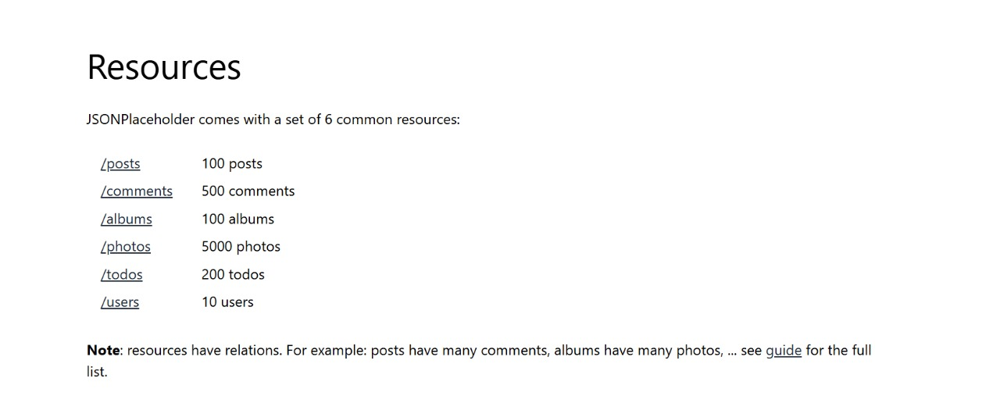
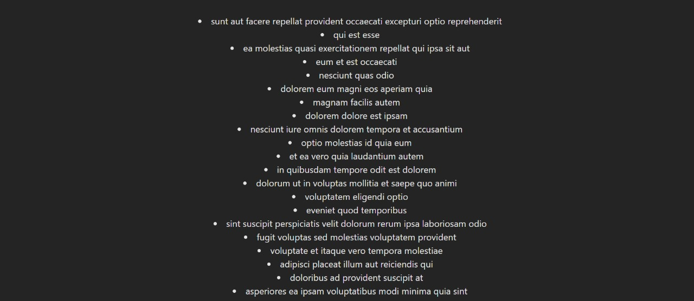
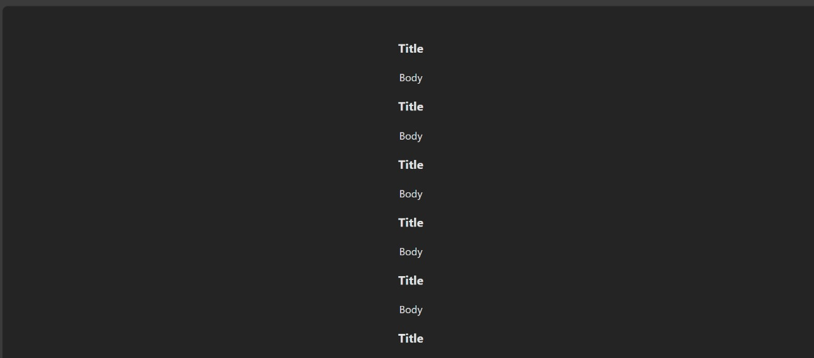
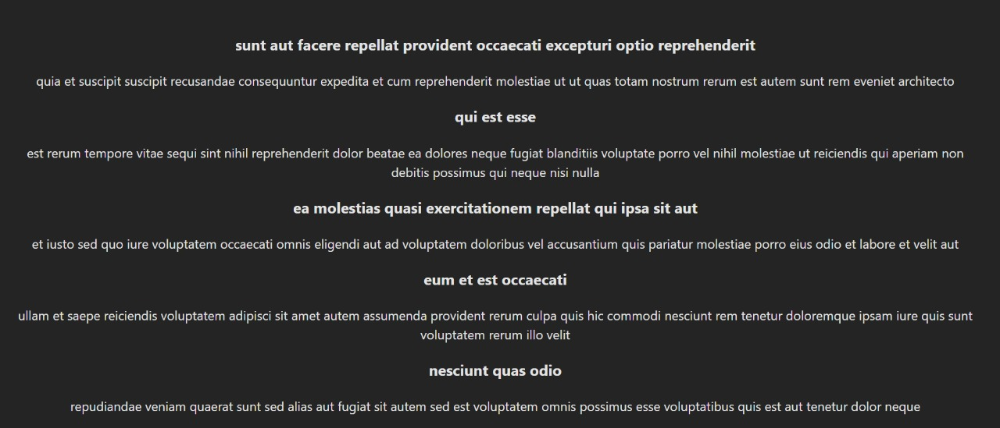
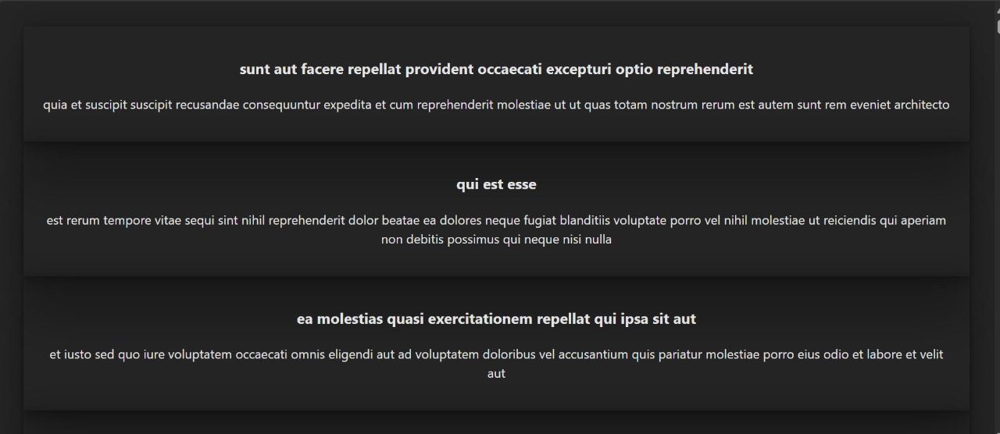
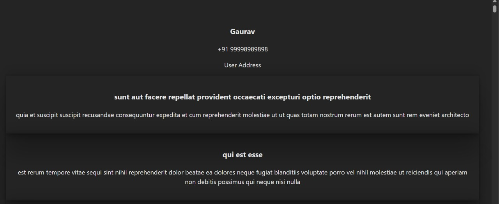
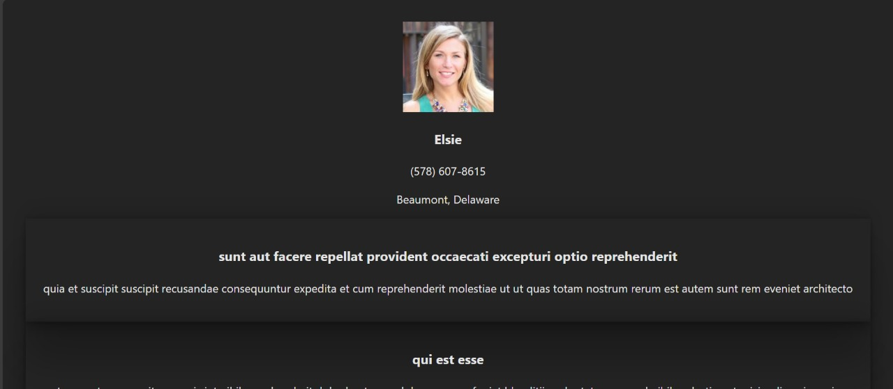
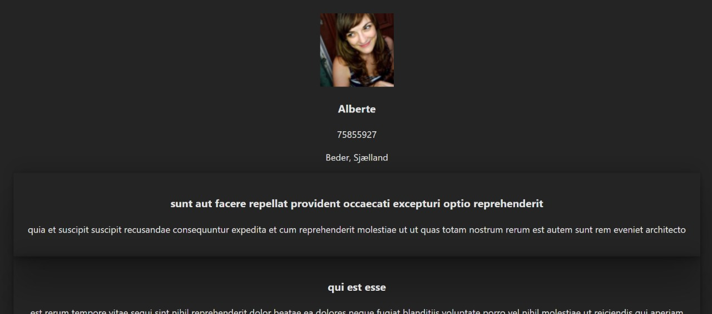
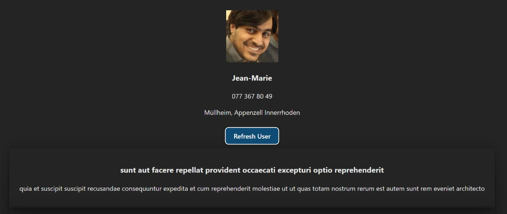
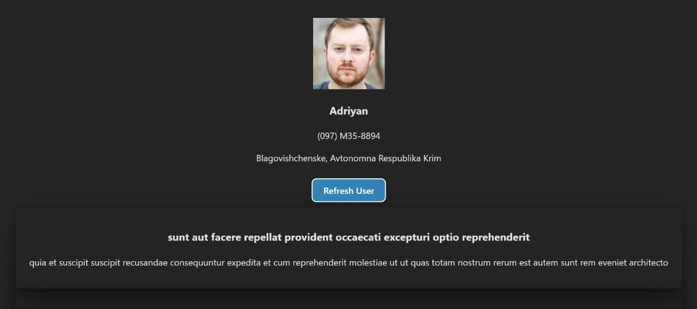

# Fetch an API with React

## 🎯 Goal
We will fetch data from an API and dynamically render it on the screen using React.

---

## 📌 What is an API?

**API** stands for **Application Programming Interface**.

### ✨ Use of API:
- APIs are used to fetch data from a network or a remote server.
  
### Basic Flow:
```plaintext
Client APP --------Request---------> API ---- Query -----> Database
Client APP <---- Response --------- API <---- Data ------- Database
```

Since we don't have our own server, we will use a free service:  
👉 [JSONPlaceholder](https://jsonplaceholder.typicode.com/)

> Go to **Resources** and select any API you want.



 For this demo, we will use:
```
https://jsonplaceholder.typicode.com/posts
```

---

## 🏗️ Setting up the API in React

### 1️⃣ Create `components/api.jsx`

```javascript
export const getPosts = async () => {
    const response = await fetch('https://jsonplaceholder.typicode.com/posts', {
        method: 'GET',
    });
    return await response.json(); // Parse the data as JSON
}
```

---

### 2️⃣ Update `App.jsx`

```javascript
import React, { useState, useEffect } from 'react';
import { getPosts } from '../components/api';
import './App.css';

function App() {
  const [data, setData] = useState(null);

  useEffect(() => {
    getPosts().then(posts => setData(posts));
  }, []);

  return (
    <div className='App'>
      {
        data ? data.map(e => <li key={e.id}>{e.title}</li>) : <p>Loading data....</p>
      }
    </div>
  );
}

export default App;
```

### ✅ Output:  
> This will list all the titles from the `/posts` API.



---

## 📝 Improving with a PostCard Component

### 3️⃣ Create `components/postcard.jsx`

```javascript
import React from "react";

const PostCard = ({ title, body }) => {
    return (
        <div className="post-card">
            <h3>{title}</h3>
            <p>{body}</p>
        </div>
    );
}

export default PostCard;
```

---

### 4️⃣ Update `App.jsx` to use `PostCard`

```javascript
import React, { useState, useEffect } from 'react';
import { getPosts } from '../components/api';
import PostCard from '../components/postcard';
import './App.css';

function App() {
  const [data, setData] = useState(null);

  useEffect(() => {
    getPosts().then(posts => setData(posts));
  }, []);

  return (
    <div className='App'>
      {
        data 
        ? data.map(e => <PostCard key={e.id} title={e.title} body={e.body} />) 
        : <p>Loading data....</p>
      }
    </div>
  );
}

export default App;
```

### ✅ Output:
> Now it will render a `PostCard` for each post with **title** and **body**.



---

## 🚀 Summary

- Fetched data using `fetch()`.
- Parsed JSON data and updated React state.
- Rendered data dynamically using a custom `PostCard` component.

---

> 🔗 **Tip**: Always remember to add a unique `key` prop when rendering lists in React!

---

## ✅ Updating PostCard with Props

### `components/postcard.jsx`

```jsx
import React from "react";

const PostCard = (props) => {
    return (
        <div className="post-card">
            <h3>{props.title}</h3>
            <p>{props.body}</p>
        </div>
    );
}

export default PostCard;
```

---

## ✅ Updating `App.jsx` to Pass Props Dynamically

### Updated `App.jsx`

```javascript
import React, { useState, useEffect } from 'react';
import { getPosts } from '../components/api';
import PostCard from '../components/postcard';
import './App.css';

function App() {
  const [data, setData] = useState(null);

  useEffect(() => {
    getPosts().then(posts => setData(posts));
  }, []);

  return (
    <div className='App'>
      {
        data 
        ? data.map(e => <PostCard key={e.id} title={e.title} body={e.body} />) 
        : <p>Loading data....</p>
      }
    </div>
  );
}

export default App;
```

---

### ✅ Output:

> Fetching **Title** and **Body** from API and listing them on screen:



---

## 🎨 After Styling (Padding + Box-Shadow)

- Added padding and box-shadow to the `.post-card` class.
  
### 🔔 Output after styling:

> Now each card has spacing and shadow for better UI:



---

# 🚀 Example 2: Random User Generator API

## 🎯 Task Overview

We will now use the **Random User Generator API** to dynamically fetch and display random user data.

## 🌐 API Reference

> **API URL:** [https://randomuser.me/api/](https://randomuser.me/api/)
> **Reference Site:** [https://randomuser.me/](https://randomuser.me/)

---

## 🔧 Steps to Implement

### 1️⃣ Setup Directory Structure

- Create a directory named `10_Random_User_Generator`.
- Copy all content from the existing `10_Fetch_an_API` directory into this new folder.

---

### 2️⃣ API Utility (`components/api.jsx`)

Add a new function `getRandomUser` to fetch user data:

```javascript
export const getPosts = async () => {
    const response = await fetch('https://jsonplaceholder.typicode.com/posts', { method: 'GET' });
    return await response.json();
}

export const getRandomUser = async () => {
    const response = await fetch('https://randomuser.me/api/', { method: 'GET' });
    return await response.json();
}
```

---

### 3️⃣ Update `App.jsx`

- Import the new API function.
- Create a new `useEffect` to fetch the random user and log it.

```javascript
import React, { useState, useEffect } from 'react';
import { getPosts, getRandomUser } from '../components/api';
import PostCard from '../components/postcard';
import './App.css';

function App() {
  const [data, setData] = useState(null);

  useEffect(() => {
    getPosts().then(posts => setData(posts));
  }, []);

  useEffect(() => {
    getRandomUser().then(user => console.log(user));
  }, []);

  return (
    <div className='App'>
      {
        data ? data.map(e => <PostCard title={e.title} body={e.body} />) : <p>Loading data....</p>
      }
    </div>
  );
}

export default App;
```

---

### 4️⃣ Create `components/UserCard.jsx`

Create a simple user card component with hardcoded data for now:

```javascript
import React from "react";

const UserCard = () => {
    return (
        <div className="user-card">
            
            <h3>Gaurav</h3>
            <p>+91 99998989898</p>
            <p>User Address</p>
        </div>
    );
}

export default UserCard;
```

---

### 5️⃣ Render `UserCard` in `App.jsx`

Update the return statement of `App.jsx`:

```javascript
import UserCard from '../components/UserCard';

return (
    <div className='App'> 
      <UserCard />
      {
        data ? data.map(e => <PostCard title={e.title} body={e.body} />) : <p>Loading data....</p>
      }
    </div>
);
```

### ✅ Full Updated `App.jsx`

```javascript
import React, { useState, useEffect } from 'react';
import { getPosts, getRandomUser } from '../components/api';
import PostCard from '../components/postcard';
import UserCard from '../components/UserCard';
import './App.css';

function App() {
  const [data, setData] = useState(null);

  useEffect(() => {
    getPosts().then(posts => setData(posts));
  }, []);

  useEffect(() => {
    getRandomUser().then(user => console.log(user));
  }, []);

  return (
    <div className='App'> 
      <UserCard />
      {
        data ? data.map(e => <PostCard title={e.title} body={e.body} />) : <p>Loading data....</p>
      }
    </div>
  );
}

export default App;
```

---

## 🎉 Output

> The `UserCard` component currently shows **hardcoded user details**.



---

## 📝 Notes:

- Currently, user data is hardcoded.
- In the next step, you will dynamically inject data fetched from the **Random User Generator API** into the `UserCard` component.

---

## Now, Updating App.jsx to give Details of Random User. by useState at App.jsx and Giving props at components/userCard.jsx

### UserCard.jsx

```jsx
import React from "react";

const UserCard = (props) => {
    if (!props.data) return <p>Loading user...</p>;
    
    console.log(props.data);
    
    return (
        <div className="user-card">
            
            <h3>{props.data.name.first}</h3>
            <p>{props.data.phone}</p>
            <p>{props.data.location.city}, {props.data.location.state}</p>
        </div>
    );
}

export default UserCard;
```

---

## App.jsx

### Change Made:
- **Old Code:**  
  `getRandomUser().then((user)=> setUserData(user.results[0]));`

- **New Code:**  
  `getRandomUser().then((user)=> setUserData(user));`

> This will allow us to use:
```jsx
const user = props.data.results[0];

return (
    <div className="user-card">
        
        <h3>{user.name.first} {user.name.last}</h3>
        <p>{user.phone}</p>
        <p>{user.location.city}, {user.location.state}</p>
    </div>
);
```

---

### Full App.jsx Code (Before Refresh Button)

```jsx
import React, { useState, useEffect } from 'react';
import { getPosts, getRandomUser } from '../components/api';
import PostCard from '../components/postcard';
import UserCard from '../components/UserCard';
import './App.css';

function App() {

  const [data, setData] = useState(null);
  const [userData, setUserData] = useState(null);

  useEffect(() => {
    getPosts().then(posts => setData(posts));
  }, []);

  useEffect(() => {
    getRandomUser().then((user) => setUserData(user.results[0]));
  }, []);

  return (
    <div className='App'> 
      <UserCard data={userData} />
      {
        data ? data.map(e => <PostCard title={e.title} body={e.body} />) : <p>Loading data....</p>
      }
    </div>
  );
}

export default App;
```

---

### Output:
- **Initial Load:**  
  

- **After Refresh (Page reload):**  
  

---

## Adding Refresh Button

### Updated Code Snippet:

```jsx
const refersh = () => {
  getRandomUser().then((user) => setUserData(user.results[0]));
}

return (
  <div className='App'> 
    <UserCard data={userData} />
    <button onClick={refersh}>Refresh User</button>
    {
      data ? data.map(e => <PostCard title={e.title} body={e.body} />) : <p>Loading data....</p>
    }
  </div>
);
```

---

### Full App.jsx Code (With Refresh Button)

```jsx
import React, { useState, useEffect } from 'react';
import { getPosts, getRandomUser } from '../components/api';
import PostCard from '../components/postcard';
import UserCard from '../components/UserCard';
import './App.css';

function App() {

  const [data, setData] = useState(null);
  const [userData, setUserData] = useState(null);

  useEffect(() => {
    getPosts().then(posts => setData(posts));
  }, []);

  useEffect(() => {
    getRandomUser().then((user) => setUserData(user.results[0]));
  }, []);

  const refersh = () => {
    getRandomUser().then((user) => setUserData(user.results[0]));
  }

  return (
    <div className='App'> 
      <UserCard data={userData} />
      <button onClick={refersh}>Refresh User</button>
      {
        data ? data.map(e => <PostCard title={e.title} body={e.body} />) : <p>Loading data....</p>
      }
    </div>
  );
}

export default App;
```

---

### Output:
- **Initial Load:**  
  

- **After Clicking Refresh Button:**  
  

---

✅ **Result:**  
Random user is being generated each time we click the refresh button.

---