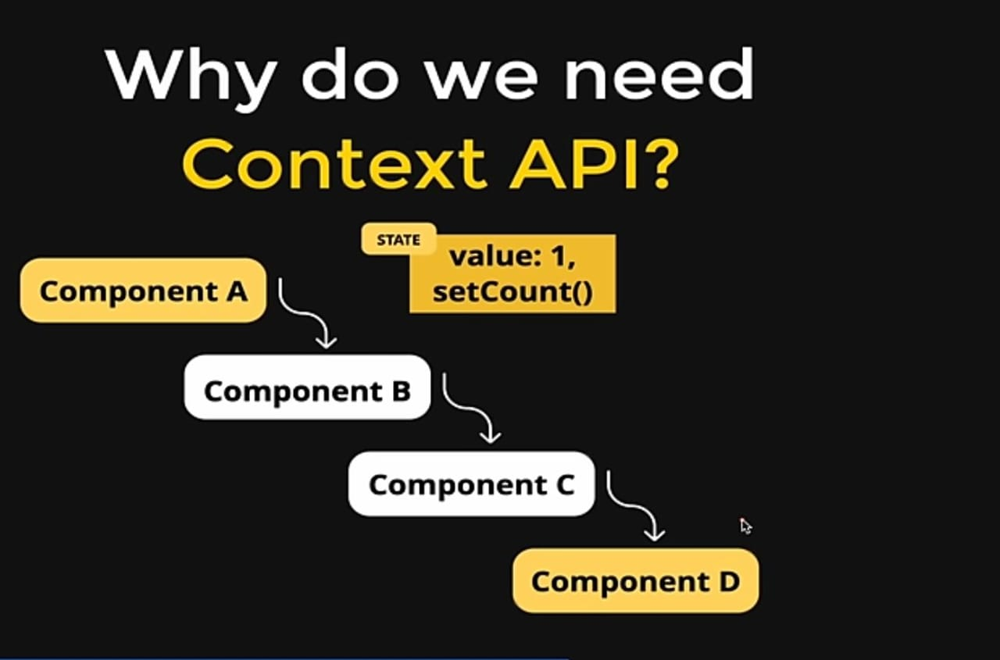
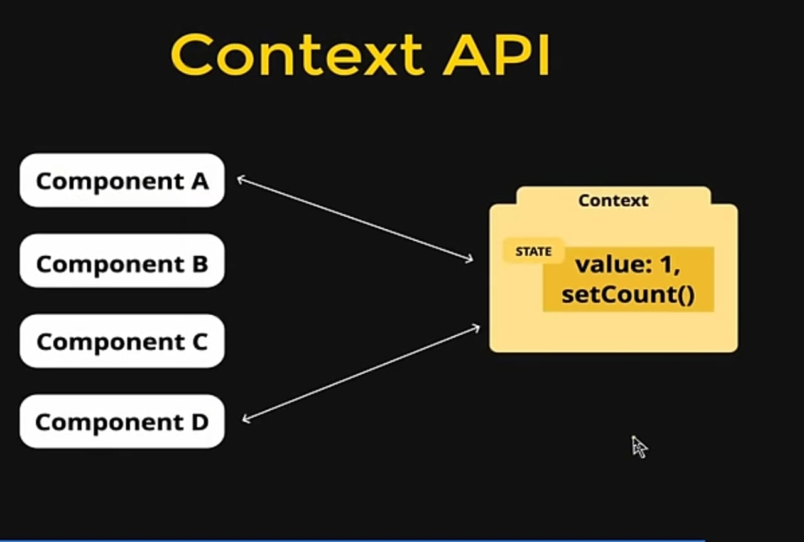
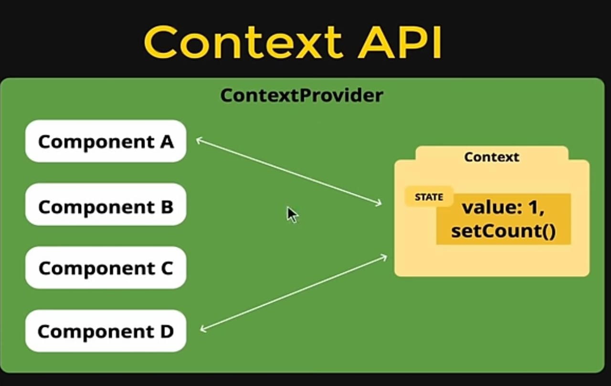
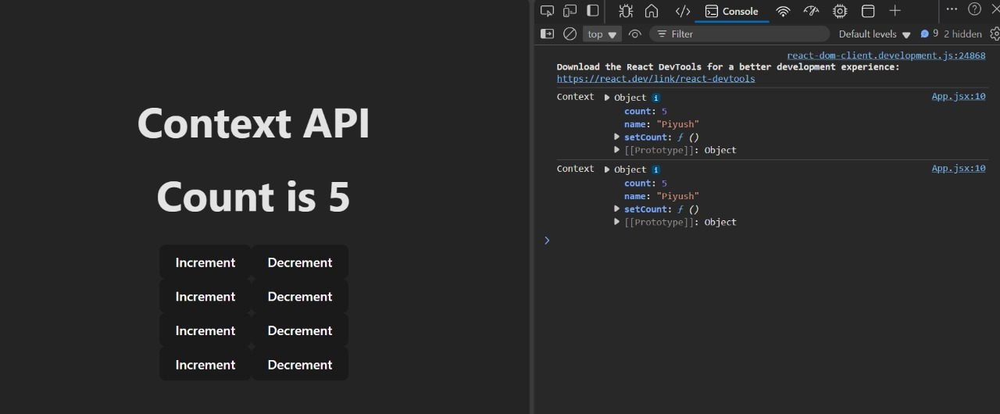
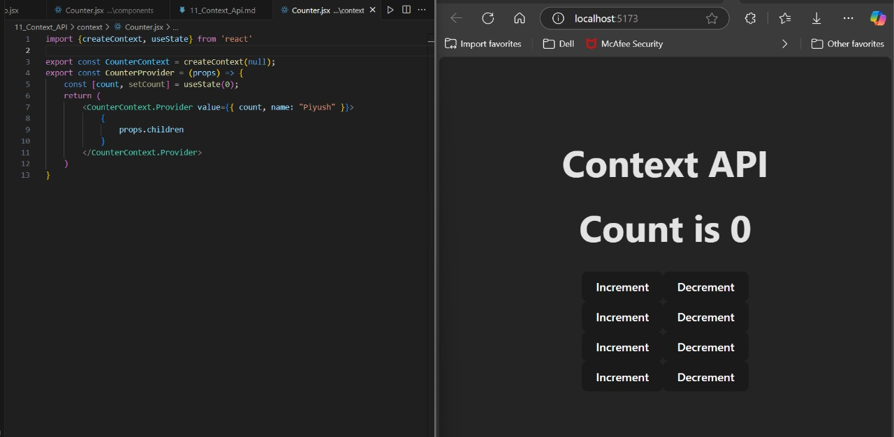
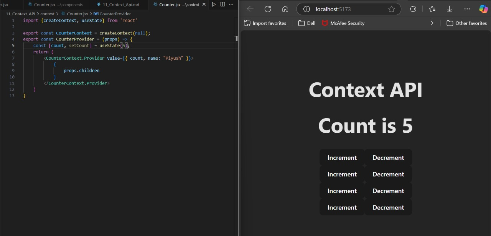
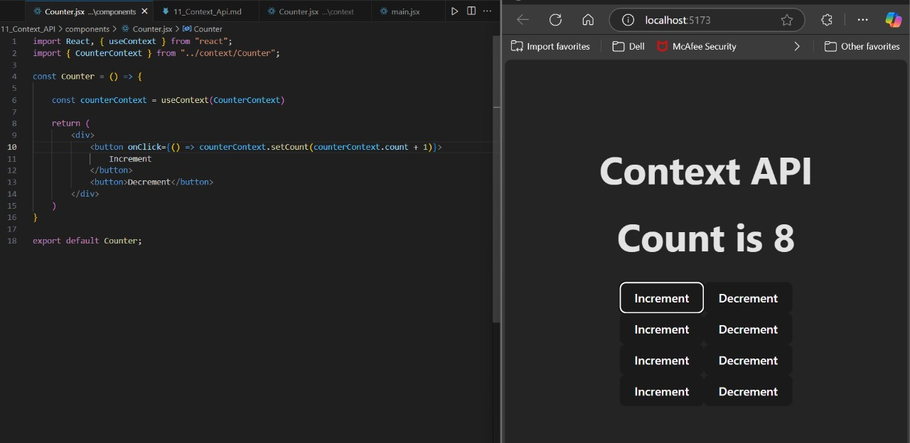
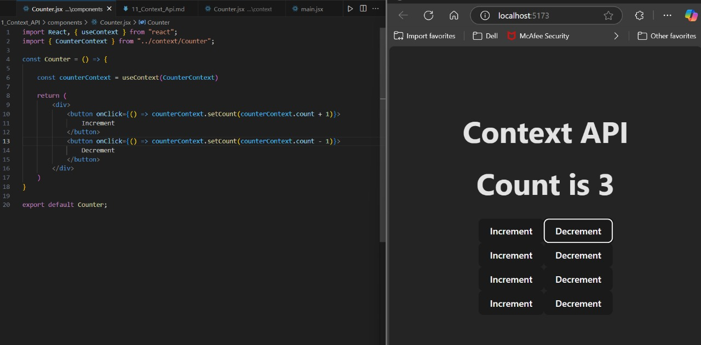
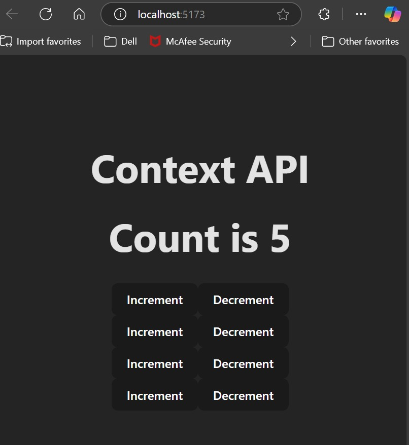
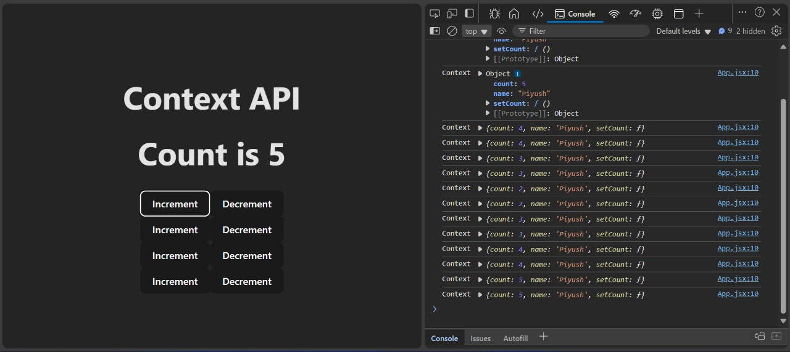

# 🧠 Why Do We Need **Context API** in React?

Imagine you're building a React application with a component hierarchy like this:

```
Component A
│
└── Component B
     │
     └── Component C
          │
          └── Component D
```

Now suppose we have a **state** defined in `Component A`:

```js
const [count, setCount] = useState(0);  // Value 1 and setCount()
```

## ❌ Way 1: **Prop Drilling**
To use `count` in `Component D`, we would have to pass it down through every intermediate component using **props**.

- `Component A` ➝ `Component B` ➝ `Component C` ➝ `Component D`

This technique is called **Prop Drilling**.

### 🚫 Why is Prop Drilling Bad?
- If you need to move `Component D` somewhere else in the component tree, you'll have to rewire everything.
- It creates unnecessary dependencies and tightly couples your component hierarchy.
- Maintenance becomes harder.

> 🖼️ **Screenshot Example:**  
> 

---

## ✅ Way 2: **Using Context API**

To solve this problem, we use **Context API**.

With Context, we can store the state in a centralized place (Context), and **any component** in the tree can access or update it **without prop drilling**.

### 🔁 Benefits of Context API:
- `Component A` and `Component D` can **both** access the state **directly** from Context.
- If the state in `Component A` changes, `Component D` will **automatically re-render**.
- We can move `Component D` anywhere in the tree without worrying about props.

> 🖼️ **Screenshot Example:**  
> 

---

## 🛡️ How Context API Works

To provide access to components, we need to **wrap them** inside a **Context Provider**.

```jsx
<ContextProvider>
  <ComponentA />
  <ComponentB />
  <ComponentC />
  <ComponentD />
</ContextProvider>
```

> 🖼️ **Screenshot Example:**  
> 

### 🔑 Note:
If we **don't wrap** components inside the Context Provider, they **won’t have access** to the shared context.

---

## 🧪 Implementation Steps

### 📁 Updated `App.jsx` in `src` folder:

```jsx
import './App.css';

function App() {
  return (
    <div className="App">
      <h1>Context API</h1>
    </div>
  );
}

export default App;
```

---

### 📁 Created `components/Counter.jsx`:

```jsx
import React from "react";

const Counter = () => {
  return (
    <div>
      <button>Increment</button>
      <button>Decrement</button>
    </div>
  );
};

export default Counter;
```

---

### 📁 Updated `App.jsx` to use the Counter:

```jsx
import './App.css';
import Counter from '../components/Counter';

function App() {
  return (
    <div className="App">
      <h1>Context API</h1>
      <h1>Count is 0</h1>
      <Counter />
      <Counter />
      <Counter />
      <Counter />
    </div>
  );
}

export default App;
```


---

## ⚛️ Now Implementing Context API in React

## 📁 Step 1: Created `context/Counter.jsx`

```jsx
import { createContext } from 'react';

// Create a context
export const CounterContext = createContext(null);
```

### 🧠 Now, we have to create a **Provider** for this context so that every component can access the shared state.

> 📸 **Screenshot Example:**  
> 

---

## 🛠️ Step 2: Updated `context/Counter.jsx` to add a Provider

```jsx
import { createContext } from 'react';

export const CounterContext = createContext(null);

// This is the CounterProvider
export const CounterProvider = (props) => {
    return (
        <CounterContext.Provider>
            <h1>Okay</h1>
        </CounterContext.Provider>
    );
};
```

---

## ✨ Step 3: Updated `context/Counter.jsx` to wrap around children

```jsx
import { createContext } from 'react';

export const CounterContext = createContext(null);

// Provider that wraps children
export const CounterProvider = (props) => {
    return (
        <CounterContext.Provider>
            {props.children}
        </CounterContext.Provider>
    );
};
```

---

## 🧱 Step 4: Default `main.jsx`

```jsx
import { StrictMode } from 'react';
import { createRoot } from 'react-dom/client';
import './index.css';
import App from './App.jsx';

createRoot(document.getElementById('root')).render(
  <StrictMode>
    <App />
  </StrictMode>,
);
```

---

## 🔁 Step 5: Updated `main.jsx` to wrap `App` with `CounterProvider`

```jsx
import { StrictMode } from 'react';
import { createRoot } from 'react-dom/client';
import './index.css';
import App from './App.jsx';

import { CounterProvider } from '../context/Counter.jsx';

createRoot(document.getElementById('root')).render(
  <StrictMode>
    <CounterProvider>
      <App />
    </CounterProvider>
  </StrictMode>,
);
```

---

## ⚙️ Step 6: Updated `context/Counter.jsx` to add `useState`

```jsx
import { createContext, useState } from 'react';

export const CounterContext = createContext(null);

export const CounterProvider = (props) => {
    const [count, setCount] = useState(0);

    return (
        <CounterContext.Provider value={{ count }}>
            {props.children}
        </CounterContext.Provider>
    );
};
```

---

## 💡 Step 7: Updated `App.jsx` to consume Context

```jsx
import { useContext } from 'react';
import './App.css';
import Counter from '../components/Counter';
import { CounterContext } from '../context/Counter';

function App() {

  const counterState = useContext(CounterContext);

  console.log("Context", counterState); // Debugging context

  return (
    <div className="App">
      <h1>Context API</h1>
      <h1>Count is 0</h1>

      <Counter />
      <Counter />
      <Counter />
      <Counter />
    </div>
  );
}

export default App;
```

### 🖥️ Output in Console:
> 

---

## ⚛️ Now Context API in React – Full Flow with State and Methods


## ✅ Step-by-Step Implementation


### 🧠 1. **Context Setup (`context/Counter.jsx`)**

```jsx
import { createContext, useState } from 'react';

// Create Context
export const CounterContext = createContext(null);

// Create Provider
export const CounterProvider = (props) => {
    const [count, setCount] = useState(5); // Initial value set to 5
    const name = "Piyush";

    return (
        <CounterContext.Provider value={{ count, setCount, name }}>
            {props.children}
        </CounterContext.Provider>
    );
};
```

---

### ⚙️ 2. **Wrap Provider in `main.jsx`**

```jsx
import { StrictMode } from 'react';
import { createRoot } from 'react-dom/client';
import './index.css';
import App from './App.jsx';
import { CounterProvider } from '../context/Counter.jsx';

createRoot(document.getElementById('root')).render(
  <StrictMode>
    <CounterProvider>
      <App />
    </CounterProvider>
  </StrictMode>,
);
```

---

### 🏠 3. **App Component (`App.jsx`)**

```jsx
import { useContext } from 'react';
import './App.css';
import Counter from '../components/Counter';
import { CounterContext } from '../context/Counter';

function App() {
  const counterState = useContext(CounterContext);

  console.log("Context", counterState);

  return (
    <div className="App">
      <h1>Context API</h1>
      <h1>Count is {counterState.count}</h1>                      {/* Dynamically displays count */}
      
      <Counter />
      <Counter />
      <Counter />
      <Counter />
    </div>
  );
}

export default App;
```

📸 **Dynamic Outputs Based on `useState` Value**:

- `useState(0)` →  
  

- `useState(5)` →  
  

---

### 🎯 4. **Update `Counter.jsx` to Modify Context State**

**Before:**
```jsx
import React from "react";

const Counter = () => {
  return (
    <div>
      <button>Increment</button>
      <button>Decrement</button>
    </div>
  );
};

export default Counter;
```

**After:**
```jsx
import React, { useContext } from "react";
import { CounterContext } from "../context/Counter";

const Counter = () => {
  const counterContext = useContext(CounterContext);

  return (
    <div>
      <button onClick={() => counterContext.setCount(counterContext.count + 1)}>
        Increment
      </button>
      <button onClick={() => counterContext.setCount(counterContext.count - 1)}>
        Decrement
      </button>
    </div>
  );
};

export default Counter;
```

📸 **Result after Increment & Decrement:**

> Incremented Count: `5 ➝ 8`  
  

> Decremented Count: `8 ➝ 3`  
  

> Refresh resets to default (5):  
  

> **Before Operation**: *Console Before Applying Operations of Increment and Decrement*  
  

> **After Operation**: *Console After Applying Operations of Increment and Decrement*
  

---

## 🧾 Summary

### ✅ What we did:

1. **Created Context** using `createContext`.
2. **Made a Provider** (`CounterProvider`) to wrap all children.
3. **Provided values**: `count`, `setCount`, and `name: "Piyush"`.
4. **Wrapped `App`** with `CounterProvider` in `main.jsx`.
5. **Used `useContext`** inside `App.jsx` and `Counter.jsx` to:
   - Display current count
   - Modify count without prop-drilling.

> 🎯 No props passed at all!  
> ✔️ Centralized state using Context  
> 💬 No prop-drilling — direct access from anywhere!


---

### 🔁 **Summary – Context API Integration**

1. **Created a Context** using `createContext()` in React to share state across components.

2. **Defined a Provider (`CounterProvider`)** inside `context/Counter.jsx` that:
   - Uses `useState` to manage `count`.
   - Provides `count`, `setCount`, and a test `name: "Piyush"` as context values.
   - Wraps its children inside `<CounterContext.Provider>` so that any component inside can access the context.

3. **Wrapped the App component** with `CounterProvider` in `main.jsx`, enabling access to the context inside the entire application:
   ```jsx
   <CounterProvider>
     <App />
   </CounterProvider>
   ```

4. Inside **`App.jsx`**:
   - Used `useContext(CounterContext)` to access context values.
   - Displayed the `count` directly from the context.
   - Confirmed values like `count` and `name` using `console.log`.

5. In **`components/Counter.jsx`**:
   - Removed all prop passing.
   - Accessed `count` and `setCount` using `useContext(CounterContext)`.
   - Used `setCount` to update the `count` via buttons for **Increment** and **Decrement**.

6. As a result:
   - We avoided **prop-drilling** (passing props through multiple components).
   - Enabled **centralized state management** via context.
   - Easily shared data and logic between components without redundancy.

---

✅ **Conclusion:**  
We established a clean and scalable architecture using Context API where any component can directly read and modify shared state. No need to pass props manually — just plug in and go!
